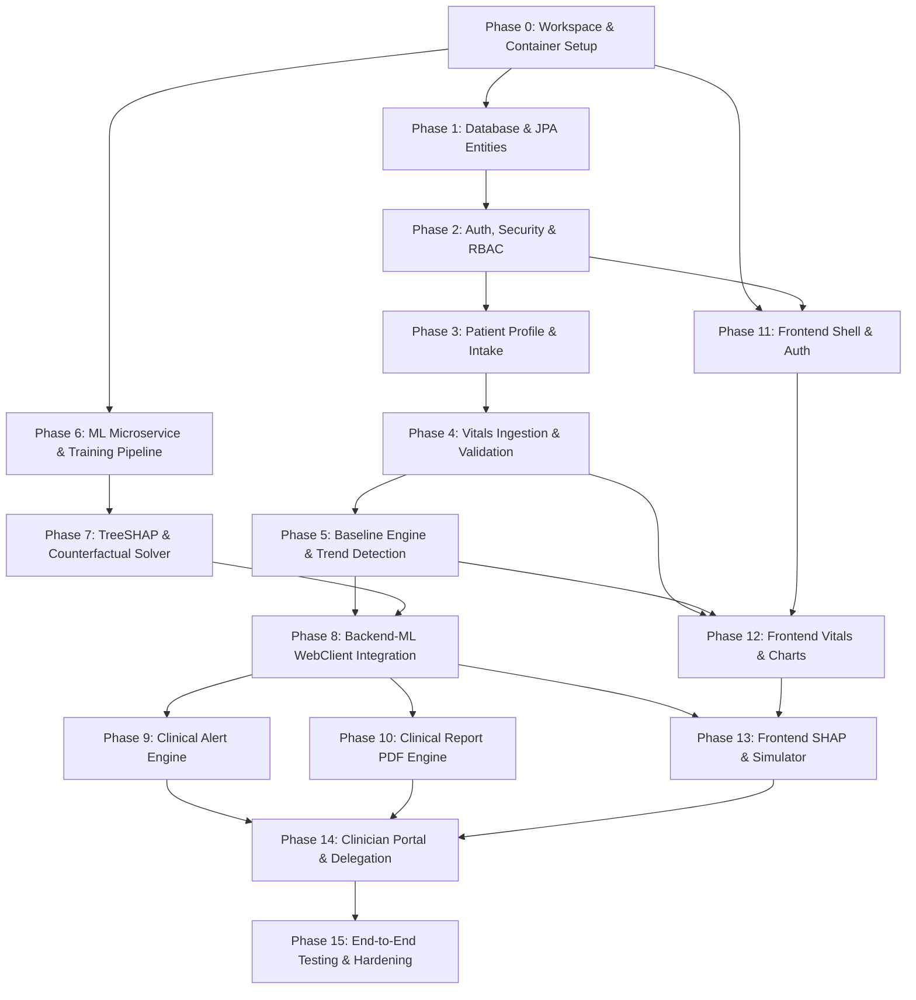

# CarePath - Dependency-Aware Development Roadmap

**Document Version:** 1.0.0  
**Project Lead:** Senior Software Architect  
**Architecture Paradigm:** Multi-Tier Clean Modular Architecture  
**Execution Strategy:** Small, Incremental, Verifiable Implementation Phases

---

## 1. Architectural Dependency Graph

The phases are structured in strict dependency order so that no module is implemented without its underlying infrastructure, contracts, or upstream data models already verified.

---

## 2. Phase-by-Phase Implementation Plan

---

### Phase 0: Workspace, Repository Structure & Docker Infrastructure
* **Objective:** Establish the multi-tier project directory structure, containerized local environment, and developer toolchains.
* **Dependencies:** None.
* **Deliverables:**
  * Root `docker-compose.yml` configuring PostgreSQL 15, Spring Boot backend, FastAPI ML service, and React frontend.
  * Maven / Gradle build configuration for Spring Boot 3.x (Java 21).
  * Python virtual environment, `pyproject.toml` or `requirements.txt` for FastAPI ML service.
  * Vite + React 18 + TypeScript + Tailwind CSS workspace initialization.
  * `.editorconfig`, `.gitignore`, and shared environment templates (`.env.example`).
* **Verification & Testing:**
  * `docker compose up -d postgres` runs cleanly and responds to `pg_isready`.
  * Spring Boot skeleton boots with `./mvnw spring-boot:run`.
  * FastAPI skeleton responds with 200 OK on `GET /ml/v1/health`.
  * React frontend serves welcome page on `http://localhost:5173`.

---

### Phase 1: Database Schema, Migrations & JPA Core Entities
* **Objective:** Define and migrate all relational database tables, foreign keys, indexes, and audit columns.
* **Dependencies:** Phase 0.
* **Deliverables:**
  * Versioned migration scripts (Flyway/Liquibase SQL) covering:
    * `users`, `patient_profiles`, `clinician_profiles`, `patient_clinician_access`
    * `vital_metrics`, `symptom_logs`, `patient_baselines`
    * `risk_assessments`, `shap_explanations`, `counterfactual_recommendations`
    * `clinical_alerts`, `audit_logs`
  * Spring Data JPA entity classes with Hibernate validation annotations (`@NotNull`, `@Size`, `@Pattern`).
  * Spring Data JPA Repository interfaces extending `JpaRepository` and `JpaSpecificationExecutor`.
* **Verification & Testing:**
  * Testcontainers integration test spinning up isolated PostgreSQL.
  * Automated migration test asserting all tables, indexes, and foreign keys create without warnings.
  * Basic CRUD tests for `User` and `PatientProfile` repositories using JUnit 5 + Spring Boot Test.

---

### Phase 2: Authentication, Authorization & Security Architecture
* **Objective:** Secure the backend with stateless JWT authentication, password hashing, and role-based access control (RBAC).
* **Dependencies:** Phase 1.
* **Deliverables:**
  * `SecurityConfig` configuring CORS, CSRF disablement (stateless), and URL access rules.
  * `JwtTokenProvider` generating signed access tokens (15m) and refresh tokens (7d).
  * `JwtAuthenticationFilter` verifying tokens on incoming requests.
  * `AuthService` handling user registration, password verification (BCrypt), login, and token refresh.
  * REST Controller: `/api/v1/auth/register`, `/api/v1/auth/login`, `/api/v1/auth/refresh`.
  * Spring Security `@PreAuthorize` method-level authorization infrastructure.
* **Verification & Testing:**
  * Unit tests with Mockito for `AuthService`.
  * MockMvc integration tests verifying:
    * Registration of duplicate email fails with 409 Conflict.
    * Weak passwords rejected with 400 Bad Request.
    * Valid login returns JWT; protected endpoint without JWT returns 401 Unauthorized.
    * Role-based access enforcement (Patient cannot access Admin endpoints).

---

### Phase 3: Patient Profile & Demographic Baseline Intake API
* **Objective:** Enable patients to create and update their demographic baseline and health history.
* **Dependencies:** Phase 2.
* **Deliverables:**
  * `PatientProfileService` and DTOs (`PatientProfileRequestDTO`, `PatientProfileResponseDTO`).
  * REST Controller: `/api/v1/patients/me`, `/api/v1/patients/{id}`.
  * Automatic BMI calculation logic upon height and weight ingestion.
  * Audit logging interceptor recording profile mutations.
* **Verification & Testing:**
  * Unit tests validating physiological bounds (height, weight ranges).
  * MockMvc tests ensuring patients can only view and update their own profile.

---

### Phase 4: Vital Metrics Ingestion & Physiological Validation Engine
* **Objective:** Support single and batch ingestion of biometric measurements with strict input validation.
* **Dependencies:** Phase 3.
* **Deliverables:**
  * `VitalMetricService` handling ingestion, batch processing, and context tagging (`FASTING`, `RESTING`, etc.).
  * Range validator rejecting non-physiological inputs (e.g., Systolic BP $> 300$ or $< 40$).
  * REST Controller: `POST /api/v1/patients/{id}/vitals`, `POST /api/v1/patients/{id}/vitals/batch`, `GET /api/v1/patients/{id}/vitals` with pagination and date-range filters.
  * Spring ApplicationEvent publication (`VitalMetricLoggedEvent`) for downstream asynchronous processors.
* **Verification & Testing:**
  * Unit tests verifying range boundary rejections.
  * Repository performance tests executing time-series range queries with composite indexes.
  * Integration tests verifying batch ingestion within a single ACID transaction.

---

### Phase 5: Personal Baseline Calculation & Trajectory Trend Detection
* **Objective:** Build the core statistical engine to establish personal baselines and detect longitudinal trends.
* **Dependencies:** Phase 4.
* **Deliverables:**
  * `BaselineEngineService`:
    * Sliding 30-day window aggregator.
    * EWMA algorithm ($\alpha = 0.2$).
    * Median, IQR ($Q_{25}, Q_{75}$), and standard deviation calculation.
  * `TrendDetectionService`:
    * Ordinary Least Squares (OLS) linear regression computing 7d, 14d, and 30d trajectory slopes ($\beta$).
    * Student's t-test significance testing ($p$-value).
    * Anomaly classifier separating transient spikes from sustained drift.
  * REST Controller: `GET /api/v1/patients/{id}/baselines`.
* **Verification & Testing:**
  * Unit tests on mathematical functions using known statistical synthetic datasets.
  * Verification that single-day outliers do not drastically distort the EWMA and IQR baseline corridors.
  * Trajectory slope tests asserting correct positive, flat, and negative trend classifications.

---

### Phase 6: Machine Learning Microservice & Calibrated Risk Model
* **Objective:** Create the standalone FastAPI microservice, feature engineering pipeline, and calibrated ensemble risk model.
* **Dependencies:** Phase 0.
* **Deliverables:**
  * Python FastAPI application skeleton with Pydantic v2 schemas.
  * Synthetic clinical cohort dataset generation script (incorporating CDC NHANES & Framingham statistical distributions).
  * Training pipeline using `HistGradientBoostingClassifier` calibrated with `CalibratedClassifierCV(method='sigmoid')`.
  * Model serialization pipeline (saving model, feature scalers, and reference background summary via `joblib`).
  * REST Endpoint: `POST /ml/v1/risk/predict`, `GET /ml/v1/health`.
* **Verification & Testing:**
  * Pytest suite verifying model load, input schema validation, and probability output calibration ($0.00 \le R \le 1.00$).
  * Calibration verification asserting Brier score $< 0.12$.
  * End-to-end response latency benchmark asserting $< 100$ ms for raw inference.

---

### Phase 7: TreeSHAP Explainability & Counterfactual Optimization Solver
* **Objective:** Implement local feature attribution via TreeSHAP and the constrained "What-If" counterfactual solver.
* **Dependencies:** Phase 6.
* **Deliverables:**
  * `shap_explainer.py` utilizing `shap.TreeExplainer` over background dataset summary.
  * Local additivity validation: $\phi_0 + \sum \phi_i = f(\mathbf{x})$.
  * Natural Language Generation (NLG) mapper generating patient-friendly descriptions from top SHAP features.
  * `counterfactual_engine.py` implementing constrained greedy sensitivity optimization over modifiable biometric parameters.
  * REST Endpoints: `POST /ml/v1/risk/explain`, `POST /ml/v1/risk/counterfactual`.
* **Verification & Testing:**
  * Pytest test asserting local additivity holds within $10^{-4}$ tolerance.
  * Invariance tests verifying immutable features (age, sex) are never modified by the counterfactual solver.
  * Plausibility clamp tests ensuring simulated vitals do not produce unphysiological values.

---

### Phase 8: Spring Boot to ML WebClient Integration & Resilient Risk Evaluation
* **Objective:** Connect the Spring Boot backend to the FastAPI ML service with circuit breakers, timeouts, and persistence.
* **Dependencies:** Phase 5, Phase 7.
* **Deliverables:**
  * `MlServiceClient` using Spring WebClient / RestClient with connection pooling and timeouts (max 1.5s).
  * Fallback strategy: If ML service times out or errors, return rule-based baseline status with graceful warning badge without throwing 500 error.
  * `RiskEvaluationService` assembling demographic and longitudinal features, invoking FastAPI, and persisting `RiskAssessment` and `ShapExplanation` entities.
  * REST Endpoints: `GET /api/v1/patients/{id}/risks/latest`, `POST /api/v1/patients/{id}/risks/evaluate`, `POST /api/v1/patients/{id}/risks/counterfactual`.
* **Verification & Testing:**
  * MockWebServer integration tests simulating FastAPI success, timeout, and HTTP 500 scenarios.
  * Verification that risk evaluations and SHAP snapshots are accurately persisted in PostgreSQL.

---

### Phase 9: Clinical Alert Engine & Notification Framework
* **Objective:** Implement the real-time clinical alert rules, threshold breach detection, and lifecycle management.
* **Dependencies:** Phase 8.
* **Deliverables:**
  * `AlertManagerService` evaluating:
    * Physiological emergency thresholds (Systolic $\ge 180$, Heart Rate $< 40$, $SpO_2 \le 88\%$).
    * Sustained 14-day adverse drift.
    * Model risk category escalation (e.g. Moderate $\rightarrow$ Elevated).
  * Alert lifecycle transitions: `NEW` $\rightarrow$ `ACKNOWLEDGED` $\rightarrow$ `RESOLVED`.
  * Internal event dispatcher (`ClinicalAlertCreatedEvent`) decoupling notification logic.
  * REST Endpoints: `GET /api/v1/patients/{id}/alerts`, `PATCH /api/v1/patients/{id}/alerts/{id}`.
* **Verification & Testing:**
  * Unit tests testing threshold trigger conditions and severity classifications.
  * Integration tests verifying alert creation and state transition timestamps.

---

### Phase 10: Clinical Consultation Report Generator (Doctor-Ready PDF)
* **Objective:** Build the print-optimized clinical report generation service for patient-doctor consultations.
* **Dependencies:** Phase 8, Phase 9.
* **Deliverables:**
  * `ReportGeneratorService` synthesizing 30/90-day vital statistics, baseline corridors, SHAP risk attribution, and active alerts.
  * Clean, vector-based PDF generation using OpenPDF / HTML-to-PDF template engine.
  * Prominent medical decision-support regulatory disclaimer on every page header and footer.
  * REST Endpoint: `GET /api/v1/patients/{id}/reports/doctor-summary.pdf`.
* **Verification & Testing:**
  * Automated test verifying valid PDF byte stream generation.
  * Visual inspection of generated PDF layout, tables, and typography.

---

### Phase 11: Frontend Shell, Design System, Authentication & Routing
* **Objective:** Build the responsive React frontend shell, design system tokens, auth flows, and protected route guards.
* **Dependencies:** Phase 2.
* **Deliverables:**
  * Tailwind CSS theme configuration (clinical color palette, tabular typography, dark/light contrast rules).
  * Global layout components: `Navbar`, `Sidebar`, `AuthLayout`, `DashboardLayout`.
  * Auth state management (Zustand / React Context) with Axios token refresh interceptors.
  * Login, Registration, and Intake pages with React Hook Form + Zod schema validation.
  * Protected route guards based on user roles (`ROLE_PATIENT`, `ROLE_CLINICIAN`).
* **Verification & Testing:**
  * End-to-end user registration and login flow in browser.
  * Token expiration and automatic silent refresh verification.
  * Responsive layout tests across desktop, tablet, and mobile viewports.

---

### Phase 12: Frontend Vitals Logging & Recharts Longitudinal Visualizations
* **Objective:** Implement interactive vitals entry forms and rich longitudinal time-series visualizations.
* **Dependencies:** Phase 4, Phase 5, Phase 11.
* **Deliverables:**
  * `VitalEntryForm` modal and quick-log widget with instant physiological boundary validation.
  * Recharts-based `LongitudinalTrendChart`:
    * Individual measurement plot points.
    * Shaded personal baseline corridor (mean $\pm 2\sigma$ or IQR).
    * Statistical anomaly callout dots for transient spikes and drift markers.
    * 7-day, 14-day, and 30-day time range toggles.
  * Metric summary cards displaying current value, EWMA baseline, and 14-day trajectory arrow.
* **Verification & Testing:**
  * Visual verification of chart responsiveness and tooltip formatting.
  * Real-time optimistic update verification upon submitting a new vital reading.

---

### Phase 13: Frontend Explainable Risk Dashboard, SHAP Waterfall & What-If Simulator
* **Objective:** Create the explainability dashboard, SHAP waterfall visualizer, and interactive counterfactual simulation controls.
* **Dependencies:** Phase 8, Phase 12.
* **Deliverables:**
  * `RiskGaugeCard` displaying calibrated risk score ($0.00 - 1.00$) and color-coded tier badge (`LOW`, `MODERATE`, `ELEVATED`, `HIGH`).
  * `ShapWaterfallChart` (Recharts horizontal bar / waterfall) visualizing positive risk drivers and negative protective factors.
  * Natural language summary card translating mathematical attributions into plain English.
  * `WhatIfSimulator` widget:
    * Interactive sliders for modifiable features (Systolic BP, Fasting Glucose, Sleep Hours).
    * Real-time debounced calls to `/risks/counterfactual`.
    * Visual delta display showing projected risk reduction and tier transitions.
  * Permanent regulatory non-diagnostic disclaimer banner.
* **Verification & Testing:**
  * User interaction testing with counterfactual sliders verifying debounced updates and smooth UI transitions.
  * Accessibility audit (contrast ratios and ARIA live regions).

---

### Phase 14: Clinician Portal, Access Delegation Flow & Doctor Report View
* **Objective:** Implement doctor dashboard, patient roster, time-limited delegation code exchange, and clinical report downloads.
* **Dependencies:** Phase 9, Phase 10, Phase 13.
* **Deliverables:**
  * Patient delegation UI: Patient generates 6-character ephemeral access code (`CARE-XXXX-XXX`).
  * Clinician Portal: Doctor enters grant code to attach patient to their clinical roster.
  * Clinician Patient Detail View: High-density clinical overview with longitudinal trends, SHAP attribution, and alert acknowledgment controls.
  * One-click "Download Doctor-Ready PDF Report" button with progress indicator.
* **Verification & Testing:**
  * Delegation flow testing: Clinician cannot access patient record without valid, active delegation grant.
  * Revocation test: Patient revokes access; clinician immediately loses access.
  * PDF report download verification in browser.

---

### Phase 15: End-to-End Integration, Security Hardening & Synthetic Scenario Walkthrough
* **Objective:** Full platform integration testing, security audit, synthetic patient scenario population, and documentation completion.
* **Dependencies:** All previous phases.
* **Deliverables:**
  * Synthetic demo data seeder script populating 3 distinct patient personas:
    * *Persona 1:* Healthy individual with stable longitudinal baseline.
    * *Persona 2:* Pre-diabetic individual with sustained 14-day upward glucose and BP drift.
    * *Persona 3:* Individual experiencing an acute physiological anomaly and safety alert.
  * OWASP Top 10 security audit (SQL injection, XSS, CSRF, security headers, JWT tamper resistance).
  * Automated end-to-end integration test suite verifying complete flow from vitals entry to SHAP explainability and PDF generation.
  * Final documentation verification: `README.md`, deployment guide, and developer onboarding instructions.
* **Verification & Testing:**
  * Full `docker compose up` starts all 4 services with zero manual interventions.
  * End-to-end synthetic demo scenario execution successfully demonstrates all functional requirements.
