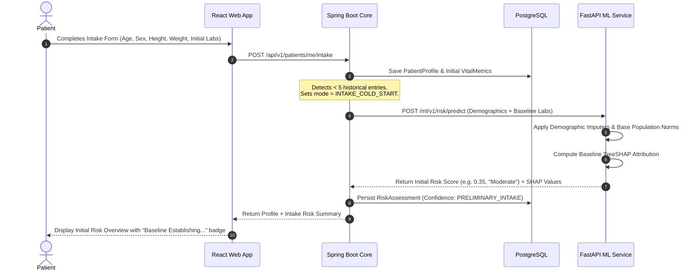
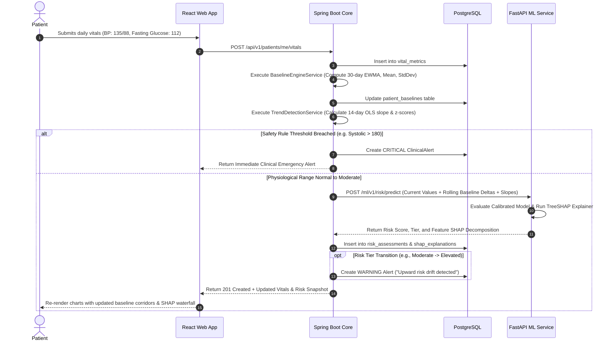
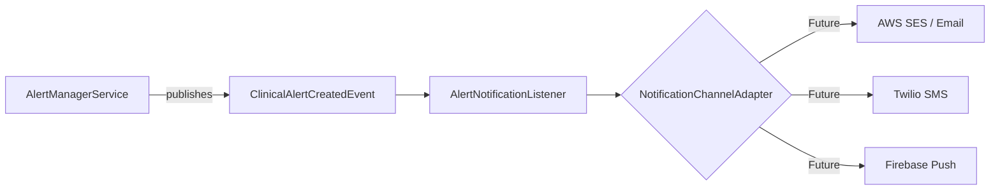

# CarePath - System & Software Architecture Specification

**Document Version:** 1.0.0  
**Target Architecture:** Distributed Clean Modular Architecture  
**Primary Components:** React SPA + Spring Boot Orchestration Engine + FastAPI ML Decision Support Microservice + PostgreSQL Relational Datastore

---

## 1. High-Level System Architecture

CarePath is structured as a three-tier micro-modular architecture designed for clinical data integrity, decoupled computational scaling, and strict privacy boundaries.

```mermaid
graph TB
    subgraph Client_Layer ["Client Layer (Browser / Mobile Web)"]
        SPA["React 18 + TypeScript SPA<br/>(Tailwind CSS, Vite, Recharts, TanStack Query)"]
    end

    subgraph Edge_Security ["Security & API Gateway Boundary"]
        LB["Reverse Proxy / NGINX (TLS 1.3 Termination)"]
    end

    subgraph Core_Backend ["Core Enterprise Service (Spring Boot 3.x / Java 21)"]
        SEC["Spring Security Filter Chain<br/>(Stateless JWT, BCrypt, RBAC)"]
        API["REST Controllers<br/>(Vitals, Baselines, Risk, Alerts, Reports)"]
        SVC["Domain Service Layer<br/>(BaselineEngine, TrendDetector, ReportGenerator)"]
        REPO["Spring Data JPA / Hibernate"]
        CLIENT["Resilient ML WebClient<br/>(CircuitBreaker, Timeout, Fallback)"]
    end

    subgraph ML_Microservice ["Explainable AI Microservice (Python 3.11 / FastAPI)"]
        FAST["FastAPI Engine<br/>(Pydantic v2 Models)"]
        PIPE["Biometric Preprocessing Pipeline<br/>(RobustScaler, Imputer, Delta Encoders)"]
        MODEL["Calibrated Ensemble Model<br/>(Scikit-Learn Classifier)"]
        SHAP_ENG["TreeSHAP Explainer Engine<br/>(Local Attribution, Base Value)"]
        CF_SOLVER["Counterfactual Sensitivity Solver<br/>(Constrained 'What-If' Optimizer)"]
    end

    subgraph Data_Storage ["Persistence Layer"]
        PG[("PostgreSQL 15+<br/>(Vitals, Baselines, Risk Snapshots, Audits)")]
    end

    SPA -->|HTTPS / REST API| LB
    LB -->|Internal Routing| SEC
    SEC --> API
    API --> SVC
    SVC --> REPO
    REPO -->|JDBC / Connection Pool (HikariCP)| PG
    SVC --> CLIENT
    CLIENT -->|Internal HTTP / Pseudonymized DTO| FAST
    FAST --> PIPE
    PIPE --> MODEL
    MODEL --> SHAP_ENG
    MODEL --> CF_SOLVER
```

### 1.1 Architectural Principles
1. **Decoupled Machine Learning Compute:** The computationally heavy, Python-ecosystem-dependent ML and SHAP calculations are completely isolated from the transactional Spring Boot backend. Heavy tree traversals and Shapley value calculations do not block user-facing database I/O or transaction threads.
2. **Pseudonymization at the ML Boundary:** The ML microservice never receives patient names, email addresses, phone numbers, or account metadata. The Spring Boot backend maps requests to a volatile or pseudonymized `patientUuid` before invoking FastAPI.
3. **Stateless Scalability:** Both the Spring Boot backend and FastAPI ML service are completely stateless. User authentication state is verified per request via signed JWTs.
4. **Resilience & Graceful Degradation:** If the ML service experiences high latency or downtime, the Spring Boot backend gracefully falls back to deterministic rule-based baseline calculations and historical displays, preventing any outage in core clinical tracking.

---

## 2. Frontend Architecture (React + TypeScript)

### 2.1 Technology Stack & Core Libraries
* **Framework:** React 18+ with TypeScript (Strict Mode).
* **Build Tooling:** Vite (Fast HMR, optimized production bundling).
* **Styling & UI Components:** Tailwind CSS for design system tokenization; Lucide React for accessible iconography; Headless UI / Radix UI primitives for accessible modal dialogs and dropdowns.
* **Data Visualization:** Recharts (SVG-based, responsive time-series charts, composite baseline bands, waterfall bar charts for SHAP attribution).
* **Server State & Data Fetching:** TanStack Query v5 (React Query) for optimistic mutations, automated background refetching, and query caching.
* **Client State Management:** Zustand or React Context for ephemeral UI states (active filters, sidebar toggle, counterfactual slider draft values).
* **HTTP Client:** Axios instance with automatic request interceptors for JWT injection and response interceptors for silent token refresh.

### 2.2 Component Hierarchy & Directory Structure

```
frontend/src/
├── app/
│   ├── routes.tsx                 # Route declarations & RBAC Protected Route guards
│   └── App.tsx                    # Root provider wrapper (QueryClient, AuthProvider)
├── assets/                        # Static SVGs, images, brand assets
├── components/
│   ├── common/                    # Button, Input, Modal, Badge, Card, Spinner
│   ├── layout/                    # Navbar, Sidebar, DashboardLayout, AuthLayout
│   ├── vitals/                    # VitalEntryForm, VitalMetricCard, QuickLogModal
│   ├── charts/                    # LongitudinalTrendChart, BaselineBandChart, AnomalyScatter
│   ├── explainability/            # ShapWaterfallChart, FeatureImportanceList, RiskGauge
│   ├── counterfactual/            # WhatIfSimulator, ParameterSliderGroup, ImpactDeltaCard
│   ├── alerts/                    # AlertBanner, AlertDrawer, CriticalModal
│   └── reports/                   # PrintableReportView, DoctorSummaryTable, ExportPdfButton
├── features/
│   ├── auth/                      # useAuth, LoginForm, RegisterForm, TokenService
│   ├── dashboard/                 # PatientDashboardPage, ClinicianDashboardPage
│   ├── vitals/                    # useVitalsQuery, useLogVitalMutation
│   ├── baseline/                  # useBaselineQuery, BaselineComparisonCard
│   ├── risk/                      # useRiskAssessment, useCounterfactualSimulation
│   └── clinician/                 # usePatientList, PatientDetailView, AccessGrantManager
├── hooks/                         # useDebounce, useMediaQuery, usePrintReport
├── services/
│   ├── api.client.ts              # Axios base instance with interceptors
│   ├── auth.service.ts            # Auth REST calls
│   ├── vitals.service.ts          # Vitals CRUD endpoints
│   ├── risk.service.ts            # Risk, SHAP, and Counterfactual endpoints
│   └── report.service.ts          # PDF download stream handler
├── types/                         # Shared TypeScript interfaces (Vitals, SHAP, Risk, User)
└── utils/                         # Date formatters, unit converters, clinical bounds constants
```

### 2.3 Visual Design System & Clinical Accessibility
* **Color Hierarchy:** Calibrated clinical palette. High-contrast indicators avoiding red-green-only distinctions (supporting deuteranopia/protanopia):
  * Low Risk / Normal: Emerald Slate (`#059669` / `#10B981`)
  * Moderate Risk / Warning: Amber Ochre (`#D97706` / `#F59E0B`)
  * Elevated Risk: Tangerine Orange (`#EA580C` / `#F97316`)
  * High Risk / Urgent: Crimson Rose (`#DC2626` / `#EF4444`)
* **Typography:** Clear tabular numerals (`font-variant-numeric: tabular-nums`) for vitals, time-series coordinates, and statistical values to prevent visual jitter.
* **WCAG 2.1 AA Compliance:** Minimum 4.5:1 text contrast ratio, comprehensive ARIA live regions for dynamically rendered clinical alerts, and full keyboard navigation for modal entry dialogs.

---

## 3. Backend Architecture (Spring Boot 3.x + Java 21)

### 3.1 Layered Clean Architecture Pattern
The backend is structured according to strict Domain-Driven Design (DDD) layered architecture principles:

```
backend/src/main/java/com/carepath/
├── api/                           # Web presentation layer
│   ├── controllers/               # REST Endpoints with OpenAPI / Swagger annotations
│   ├── dto/                       # Request/Response Data Transfer Objects (Pojos)
│   ├── mappers/                   # MapStruct interfaces (Entity <-> DTO)
│   └── exception/                 # GlobalExceptionHandler, Custom Exceptions
├── domain/                        # Core business logic & models
│   ├── models/                    # Aggregate Roots & Domain Entities (User, Vital, Baseline)
│   ├── enums/                     # MetricType, RiskCategory, AlertSeverity, Role
│   └── repository/                # Spring Data JPA Repository interfaces
├── service/                       # Business operations orchestration
│   ├── AuthService.java           # Authentication, Token generation, Password hashing
│   ├── VitalMetricService.java    # Physiological validation, batch write, event publish
│   ├── BaselineEngineService.java # EWMA, sliding-window standard deviations, IQR bounds
│   ├── TrendDetectionService.java # OLS trajectory regression, sustained drift detectors
│   ├── RiskEvaluationService.java # Gathers feature vector, coordinates with ML microservice
│   ├── AlertManagerService.java   # Rule-based safety limits + ML anomaly triage
│   └── ReportGeneratorService.java# HTML template compilation & OpenPDF generation
├── client/ml/                     # Integration adapter with ML Microservice
│   ├── MlServiceClient.java      # Spring WebClient / RestClient calling FastAPI
│   ├── MlServiceProperties.java  # Connection pools, timeouts, retry backoff configs
│   └── dto/                       # ML Request/Response payload schemas
├── security/                      # Enterprise Security Layer
│   ├── JwtTokenProvider.java      # Signing, parsing, validation
│   ├── JwtAuthenticationFilter.java# Per-request authorization header inspection
│   ├── SecurityConfig.java        # Filter chain, CORS, CSRF, URL authorization
│   └── CustomUserDetailsService.java
└── config/                        # Infrastructure Beans (Auditing, Async, Caching)
```

### 3.2 Spring Security & Authorization Architecture
1. **Stateless JWT Security Filter Chain:**
   * Incoming requests pass through `JwtAuthenticationFilter`.
   * The filter extracts the Bearer token from the `Authorization` header or secure cookie.
   * Signature and expiration are verified using an RSA public key or HMAC-SHA256 secret.
   * `SecurityContextHolder` is populated with an authenticated `UsernamePasswordAuthenticationToken` containing authorities (`ROLE_PATIENT`, `ROLE_CLINICIAN`, `ROLE_ADMIN`).
2. **Method-Level Security & Data Ownership Isolation:**
   * Every patient-scoped endpoint is guarded with Spring Security expressions:
     ```java
     @PreAuthorize("hasRole('ADMIN') or " +
                   "(hasRole('PATIENT') and #patientId == principal.id) or " +
                   "(hasRole('CLINICIAN') and @accessGrantService.hasActiveAccess(principal.id, #patientId))")
     ```
   * This guarantees that a patient can never access or modify another patient's health records, and a clinician can only view records for which an active, unexpired delegation grant exists.

### 3.3 Domain Services & Algorithmic Engines
* **BaselineEngineService:** Performs rolling statistical analysis over a 30-day temporal window. Computes EWMA ($\alpha = 0.2$), sliding mean, standard deviation, and median.
* **TrendDetectionService:** Implements Ordinary Least Squares (OLS) linear regression on timestamped metric arrays to detect trajectory slopes ($\beta$). Flags sustained upward or downward trends spanning $> 14$ days.
* **AlertManagerService:** Subscribes to vital logging events. Evaluates entries against hard physiological safety boundaries (e.g. Systolic $> 180$, Heart Rate $< 40$), baseline deviation bounds ($|z| > 2.5$), and ML risk tier escalations.

---

## 4. Machine Learning Microservice Architecture (Python + FastAPI)

### 4.1 Internal Architecture
The ML service is built as a high-performance, stateless microservice leveraging Python 3.11, FastAPI, Pydantic v2, scikit-learn, and the SHAP library.

```
ml_service/
├── app/
│   ├── api/
│   │   ├── routes/
│   │   │   ├── predict.py         # /ml/v1/risk/predict
│   │   │   ├── explain.py         # /ml/v1/risk/explain
│   │   │   ├── counterfactual.py  # /ml/v1/risk/counterfactual
│   │   │   └── health.py          # /ml/v1/health (Liveness & Model Info)
│   ├── core/
│   │   ├── config.py              # App settings, environment vars
│   │   └── logging.py             # Structured JSON logger with request correlation IDs
│   ├── models/                    # Pydantic v2 request/response schemas
│   │   ├── feature_vector.py
│   │   ├── prediction_result.py
│   │   └── shap_response.py
│   ├── services/
│   │   ├── model_registry.py      # Singleton loader for serialized model & scaler artifacts
│   │   ├── preprocessing.py       # Imputation, feature interaction, robust scaling
│   │   ├── inference_engine.py    # Calibrated prediction logic
│   │   ├── shap_explainer.py      # TreeSHAP computation & attribution formatting
│   │   └── counterfactual_engine.py# Constrained optimization solver
│   └── artifacts/                 # Versioned model binaries (joblib / onnx)
│       ├── model_v1.0.0.joblib
│       ├── scaler_v1.0.0.joblib
│       └── background_summary.joblib
├── tests/                         # Pytest suite
│   ├── test_preprocessing.py
│   ├── test_inference.py
│   ├── test_shap_additivity.py
│   └── test_counterfactual.py
├── requirements.txt
└── Dockerfile
```

### 4.2 Machine Learning Inference & SHAP Pipeline
1. **Model Architecture:**
   * A calibrated ensemble tree model (`HistGradientBoostingClassifier` or `RandomForestClassifier` calibrated via `CalibratedClassifierCV(method='sigmoid')`).
   * Produces well-calibrated posterior probabilities representing continuous cardiometabolic risk signals in $[0.00, 1.00]$.
2. **Local Feature Attribution (TreeSHAP):**
   * Computes exact Shapley values using `shap.TreeExplainer(model, data=background_summary)`.
   * Guaranteed local additivity: The sum of individual feature SHAP contributions plus the expected base value equals the log-odds or probability prediction output.
3. **Counterfactual Optimization Solver:**
   * Solves a constrained minimization problem:
     $$\min_{\delta} \|\delta\|_W \quad \text{s.t.} \quad R(x + \delta) \le R_{\text{target}}, \quad x_{\min} \le x + \delta \le x_{\max}, \quad \delta_{\text{immutable}} = 0$$
   * Where $W$ is a diagonal feasibility weight matrix penalizing drastic lifestyle shifts over gradual, clinically achievable adjustments.

---

## 5. End-to-End Data & Execution Flows

### 5.1 New-Patient Intake Flow ("Cold-Start" Assessment)



### 5.2 Existing-Patient Longitudinal Analysis Flow



---

## 6. Subsystem Architectural Specifications

### 6.1 Personal Baseline Calculation Architecture
* **Algorithm:** Hybrid EWMA & Robust Sliding Window.
* **Formula:**
  $$\text{EWMA}_t = \alpha \cdot x_t + (1 - \alpha) \cdot \text{EWMA}_{t-1}$$
  With default smoothing factor $\alpha = 0.20$.
* **Robust Dispersion:** Computes the Median and Interquartile Range ($IQR = Q_{75} - Q_{25}$) to establish non-parametric confidence bands that are resilient to single-day measurement spikes.
* **Storage Optimization:** Baselines are cached in the `patient_baselines` table and recalculated incrementally upon each new ingestion or via a scheduled nightly batch job for patients with high-frequency logging.

### 6.2 Trend Detection Architecture
* **Slope Calculation:** Ordinary Least Squares (OLS) regression over trailing windows $W \in \{7, 14, 30\}$ days.
* **Significance Testing:** Computes Student's $t$-statistic on the regression slope $\beta$:
  $$t = \frac{\beta}{SE(\beta)}$$
  If $p < 0.05$ and $|\beta| > \beta_{\text{threshold}}$, the trend is classified as a *Statistically Significant Longitudinal Shift*.
* **Anomaly Classification Matrix:**
  * If $x_t > \mu + 3.0\sigma$ but $x_{t+1} \approx \mu \implies$ **Transient Outlier Spike** (ignored for model drift alerts).
  * If $x_t > \mu + 2.0\sigma$ across 3 consecutive measurements with $\beta > 0 \implies$ **Sustained Adverse Drift** (triggers Clinical Alert).

### 6.3 Risk Prediction & TreeSHAP Explainability Architecture
* **Input Feature Vector Composition:**
  1. *Static Attributes:* Age, Biological Sex, Smoking Status, Family History Index.
  2. *Current Instantaneous Metrics:* Systolic BP, Diastolic BP, Heart Rate, Fasting Glucose, HbA1c, Total/HDL Ratio, BMI, Sleep, $SpO_2$.
  3. *Dynamic Longitudinal Features:* 30-day baseline delta ($\Delta = x_{\text{current}} - \mu_{\text{baseline}}$), 14-day trajectory slope ($\beta$), Metric Instability Index ($CV$).
* **Additive Explanation Formulation:**
  For each patient evaluation $x$, the predicted risk score $f(x)$ is broken down as:
  $$f(x) = \phi_0 + \sum_{j=1}^{M} \phi_j(x)$$
  * $\phi_0$: Base risk expectation (population average).
  * $\phi_j(x) > 0$: Biomarkers that push risk higher (e.g., fasting glucose slope $\phi = +0.14$).
  * $\phi_j(x) < 0$: Biomarkers that keep risk lower (e.g., optimal HDL cholesterol $\phi = -0.08$).

### 6.4 Counterfactual Analysis Architecture
* **Goal:** Enable the patient to answer: *"What changes would bring my risk signal into the Low or Moderate range?"*
* **Heuristic Search:**
  1. The user adjusts a target slider (e.g., reducing systolic BP from 138 to 124 mmHg).
  2. The frontend sends the simulated vector to `/api/v1/patients/{id}/risks/counterfactual`.
  3. Spring Boot delegates to FastAPI `/ml/v1/risk/counterfactual`.
  4. The model computes the new probability and relative risk reduction:
     $$\Delta R = R(x_{\text{simulated}}) - R(x_{\text{actual}})$$
  5. The solver highlights the minimum combination of realistic biometric modifications needed to transition down one risk tier.

### 6.5 Clinical Alerts & Escalation Architecture
* **Alert Trigger Categories:**
  1. *Physiological Emergency (Critical):* Immediate rule override (e.g., Systolic $\ge 180$, Diastolic $\ge 120$, $SpO_2 \le 88\%$).
  2. *Longitudinal Escalation (Urgent):* Multi-marker sustained adverse drift over 14 days.
  3. *Model Risk Drift (Warning):* Transition from Moderate to Elevated risk.
  4. *Engagement Reminder (Info):* Vitals not recorded for $> 7$ days.
* **State Machine:** `NEW` $\longrightarrow$ `ACKNOWLEDGED` $\longrightarrow$ `RESOLVED`.
* Clinicians and patients can record resolution notes when dismissing or addressing an alert.

### 6.6 Report Generation Architecture
* **Format:** High-density, print-optimized HTML rendered to vector PDF via OpenPDF / iText in Spring Boot.
* **Report Components:**
  * Patient Demographics & Monitoring Time Window.
  * Summary Vital Statistics Table (Mean, Min, Max, Trend Direction).
  * Time-Series Charts with Shaded Personal Baseline Corridors.
  * Cardiometabolic Risk Index & SHAP Feature Contribution Waterfall.
  * Recorded Symptoms & Clinician Observation Section.
  * Mandatory Regulatory CDS Disclaimer.

---

## 7. Future Integration Architectures

### 7.1 Future Notification Service Architecture
To support multi-channel asynchronous alerts without polluting domain code:
* Spring Boot emits `ClinicalAlertCreatedEvent` via an internal `ApplicationEventPublisher`.
* An asynchronous event listener (`AlertNotificationListener`) handles dispatching.
* The system is designed with a clean interface (`NotificationChannelAdapter`) ready to support:
  * Email (SendGrid / AWS SES)
  * SMS (Twilio)
  * Push Notifications (Firebase Cloud Messaging - FCM)
  * Webhook integrations for external Electronic Health Record (EHR) platforms.



### 7.2 Future Wearable Integration Architecture
To ingest continuous data streams from Apple HealthKit, Google Health Connect, and Garmin Health:
* **Adapter Pattern (`WearableIngestionAdapter`):**
  * Ingests JSON/FHIR payloads into a standardized `RawBiometricStreamDTO`.
  * An asynchronous queue processes high-frequency samples (e.g., continuous heart rate) and aggregates them into daily resting and episodic summaries before persisting to `vital_metrics`.
* **FHIR Compliance:** Internal metric mappings adhere to standard LOINC (Logical Observation Identifiers Names and Codes) and SNOMED CT codes:
  * Systolic BP: LOINC `8480-6`
  * Diastolic BP: LOINC `8462-4`
  * Heart Rate: LOINC `8867-4`
  * Fasting Blood Glucose: LOINC `1558-6`
  * $SpO_2$: LOINC `2708-6`
