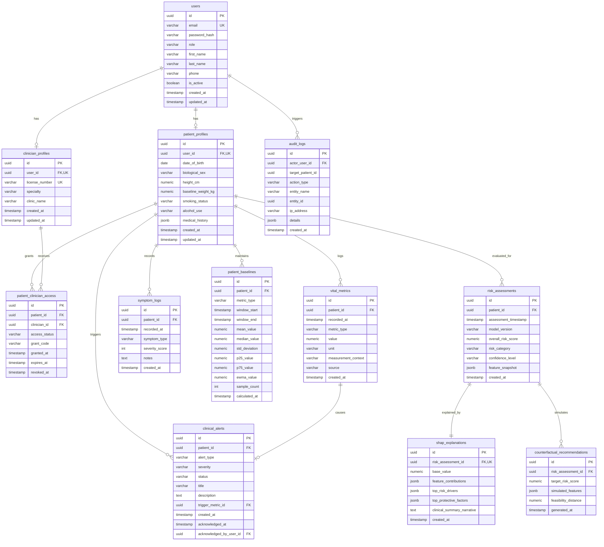

# CarePath - Relational Database Design Specification

**Document Version:** 1.0.0  
**Database Engine:** PostgreSQL 15+  
**ORM / Data Access:** Spring Data JPA / Hibernate 6.x  
**Migration Strategy:** Flyway / Liquibase Versioned Migrations

---

## 1. Entity-Relationship Overview

The CarePath database schema is designed for clinical temporal integrity, strict patient data isolation, fast time-series analytical queries, and transparent explainability tracking.



---

## 2. Table Specifications & Data Dictionaries

### 2.1 Table: `users`
Stores identity credentials, authentication roles, and primary profile contacts.

| Column | Type | Constraints | Description |
| :--- | :--- | :--- | :--- |
| `id` | `UUID` | `PRIMARY KEY`, Default: `gen_random_uuid()` | Unique user identifier. |
| `email` | `VARCHAR(255)` | `NOT NULL`, `UNIQUE` | Normalized lowercase email address. |
| `password_hash` | `VARCHAR(255)` | `NOT NULL` | BCrypt encrypted hash (12 salt rounds). |
| `role` | `VARCHAR(32)` | `NOT NULL` | Role enum: `ROLE_PATIENT`, `ROLE_CLINICIAN`, `ROLE_ADMIN`. |
| `first_name` | `VARCHAR(100)` | `NOT NULL` | Legal first name. |
| `last_name` | `VARCHAR(100)` | `NOT NULL` | Legal surname. |
| `phone` | `VARCHAR(30)` | `NULLABLE` | E.164 formatted phone number. |
| `is_active` | `BOOLEAN` | `NOT NULL`, Default: `TRUE` | Soft deactivation flag. |
| `created_at` | `TIMESTAMPTZ` | `NOT NULL`, Default: `NOW()` | Account creation timestamp. |
| `updated_at` | `TIMESTAMPTZ` | `NOT NULL`, Default: `NOW()` | Last profile modification timestamp. |

### 2.2 Table: `patient_profiles`
Holds patient-specific baseline demographic, physiological, and clinical history attributes.

| Column | Type | Constraints | Description |
| :--- | :--- | :--- | :--- |
| `id` | `UUID` | `PRIMARY KEY`, Default: `gen_random_uuid()` | Patient aggregate root identifier. |
| `user_id` | `UUID` | `NOT NULL`, `UNIQUE`, `FK -> users(id) ON DELETE CASCADE` | Identity account reference. |
| `date_of_birth` | `DATE` | `NOT NULL` | Date of birth for dynamic age calculation. |
| `biological_sex` | `VARCHAR(16)` | `NOT NULL`, `CHECK (biological_sex IN ('MALE', 'FEMALE', 'INTERSEX', 'OTHER'))` | Biological sex for metabolic baselines. |
| `height_cm` | `NUMERIC(5,2)` | `NOT NULL`, `CHECK (height_cm BETWEEN 50.0 AND 260.0)` | Patient height in centimeters. |
| `baseline_weight_kg`| `NUMERIC(5,2)` | `NOT NULL`, `CHECK (baseline_weight_kg BETWEEN 20.0 AND 400.0)` | Baseline weight in kilograms. |
| `smoking_status` | `VARCHAR(32)` | `NOT NULL`, Default: `'NEVER'` | Enum: `CURRENT_DAILY`, `CURRENT_OCCASIONAL`, `FORMER`, `NEVER`. |
| `alcohol_use` | `VARCHAR(32)` | `NOT NULL`, Default: `'NONE'` | Enum: `NONE`, `OCCASIONAL`, `MODERATE`, `HEAVY`. |
| `medical_history` | `JSONB` | `NOT NULL`, Default: `'{}'` | Diagnosed conditions (e.g. `{"hypertension": true, "family_diabetes": true}`). |
| `created_at` | `TIMESTAMPTZ` | `NOT NULL`, Default: `NOW()` | Record creation timestamp. |
| `updated_at` | `TIMESTAMPTZ` | `NOT NULL`, Default: `NOW()` | Record modification timestamp. |

### 2.3 Table: `clinician_profiles`
Maintains verified healthcare provider credentials and practice affiliations.

| Column | Type | Constraints | Description |
| :--- | :--- | :--- | :--- |
| `id` | `UUID` | `PRIMARY KEY`, Default: `gen_random_uuid()` | Clinician profile identifier. |
| `user_id` | `UUID` | `NOT NULL`, `UNIQUE`, `FK -> users(id) ON DELETE CASCADE` | Identity account reference. |
| `license_number` | `VARCHAR(100)` | `NOT NULL`, `UNIQUE` | State/National medical license registration number. |
| `specialty` | `VARCHAR(100)` | `NOT NULL` | Medical discipline (e.g., Internal Medicine, Cardiology, Primary Care). |
| `clinic_name` | `VARCHAR(200)` | `NOT NULL` | Associated hospital or clinic practice name. |
| `created_at` | `TIMESTAMPTZ` | `NOT NULL`, Default: `NOW()` | Profile creation timestamp. |
| `updated_at` | `TIMESTAMPTZ` | `NOT NULL`, Default: `NOW()` | Profile modification timestamp. |

### 2.4 Table: `patient_clinician_access`
Manages explicit patient authorization and consent delegation for clinical review.

| Column | Type | Constraints | Description |
| :--- | :--- | :--- | :--- |
| `id` | `UUID` | `PRIMARY KEY`, Default: `gen_random_uuid()` | Delegation grant record ID. |
| `patient_id` | `UUID` | `NOT NULL`, `FK -> patient_profiles(id) ON DELETE CASCADE` | Granting patient. |
| `clinician_id` | `UUID` | `NOT NULL`, `FK -> clinician_profiles(id) ON DELETE CASCADE` | Authorized clinician. |
| `access_status` | `VARCHAR(20)` | `NOT NULL`, Default: `'PENDING'` | Enum: `PENDING`, `ACTIVE`, `EXPIRED`, `REVOKED`. |
| `grant_code` | `VARCHAR(64)` | `NULLABLE` | Ephemeral secure code generated by patient for doctor onboarding. |
| `granted_at` | `TIMESTAMPTZ` | `NULLABLE` | Timestamp when consent was activated. |
| `expires_at` | `TIMESTAMPTZ` | `NULLABLE` | Expiration timestamp (e.g., 30-day access). |
| `revoked_at` | `TIMESTAMPTZ` | `NULLABLE` | Explicit revocation timestamp. |

### 2.5 Table: `vital_metrics`
Core longitudinal biometric time-series store.

| Column | Type | Constraints | Description |
| :--- | :--- | :--- | :--- |
| `id` | `UUID` | `PRIMARY KEY`, Default: `gen_random_uuid()` | Metric entry ID. |
| `patient_id` | `UUID` | `NOT NULL`, `FK -> patient_profiles(id) ON DELETE CASCADE` | Patient owner. |
| `recorded_at` | `TIMESTAMPTZ` | `NOT NULL` | Actual clinical time of measurement. |
| `metric_type` | `VARCHAR(32)` | `NOT NULL` | Enum: `SYSTOLIC_BP`, `DIASTOLIC_BP`, `HEART_RATE`, `FASTING_GLUCOSE`, `HBA1C`, `CHOLESTEROL_TOTAL`, `CHOLESTEROL_HDL`, `CHOLESTEROL_LDL`, `TRIGLYCERIDES`, `WEIGHT_KG`, `BMI`, `SPO2`, `SLEEP_HOURS`, `STEPS`. |
| `value` | `NUMERIC(8,2)` | `NOT NULL` | Precise scalar reading. |
| `unit` | `VARCHAR(20)` | `NOT NULL` | Standard unit: `mmHg`, `bpm`, `mg/dL`, `%`, `kg`, `hours`, `count`. |
| `measurement_context`| `VARCHAR(32)` | `NOT NULL`, Default: `'RESTING'` | Enum: `RESTING`, `FASTING`, `POST_PRANDIAL`, `EXERCISE`, `WAKING`. |
| `source` | `VARCHAR(32)` | `NOT NULL`, Default: `'MANUAL'` | Enum: `MANUAL`, `WEARABLE_SIM`, `DEVICE_BLE`, `EHR_IMPORT`. |
| `created_at` | `TIMESTAMPTZ` | `NOT NULL`, Default: `NOW()` | Server ingestion timestamp. |

### 2.6 Table: `symptom_logs`
Subjective patient-reported symptom journal.

| Column | Type | Constraints | Description |
| :--- | :--- | :--- | :--- |
| `id` | `UUID` | `PRIMARY KEY`, Default: `gen_random_uuid()` | Log ID. |
| `patient_id` | `UUID` | `NOT NULL`, `FK -> patient_profiles(id) ON DELETE CASCADE` | Patient reference. |
| `recorded_at` | `TIMESTAMPTZ` | `NOT NULL` | Symptom onset / observation time. |
| `symptom_type` | `VARCHAR(64)` | `NOT NULL` | Standardized symptom (e.g. `FATIGUE`, `DIZZINESS`, `CHEST_DISCOMFORT`, `HEADACHE`). |
| `severity_score` | `INT` | `NOT NULL`, `CHECK (severity_score BETWEEN 1 AND 10)` | Severity rating on 1–10 scale. |
| `notes` | `TEXT` | `NULLABLE` | Patient qualitative commentary (max 1000 chars). |
| `created_at` | `TIMESTAMPTZ` | `NOT NULL`, Default: `NOW()` | Database write timestamp. |

### 2.7 Table: `patient_baselines`
Persisted rolling statistical baselines per patient and biomarker.

| Column | Type | Constraints | Description |
| :--- | :--- | :--- | :--- |
| `id` | `UUID` | `PRIMARY KEY`, Default: `gen_random_uuid()` | Baseline record ID. |
| `patient_id` | `UUID` | `NOT NULL`, `FK -> patient_profiles(id) ON DELETE CASCADE` | Target patient. |
| `metric_type` | `VARCHAR(32)` | `NOT NULL` | Target vital metric enum. |
| `window_start` | `TIMESTAMPTZ` | `NOT NULL` | Start timestamp of rolling evaluation window. |
| `window_end` | `TIMESTAMPTZ` | `NOT NULL` | End timestamp of rolling evaluation window. |
| `mean_value` | `NUMERIC(8,2)` | `NOT NULL` | Arithmetic mean over window. |
| `median_value`| `NUMERIC(8,2)` | `NOT NULL` | Median (50th percentile) over window. |
| `std_deviation`| `NUMERIC(8,2)` | `NOT NULL` | Sample standard deviation ($\sigma$). |
| `p25_value` | `NUMERIC(8,2)` | `NOT NULL` | 25th percentile ($Q_1$). |
| `p75_value` | `NUMERIC(8,2)` | `NOT NULL` | 75th percentile ($Q_3$). |
| `ewma_value` | `NUMERIC(8,2)` | `NOT NULL` | Exponentially Weighted Moving Average ($\alpha = 0.2$). |
| `sample_count` | `INT` | `NOT NULL` | Number of observations included in window. |
| `calculated_at`| `TIMESTAMPTZ` | `NOT NULL`, Default: `NOW()` | Computation timestamp. |

### 2.8 Table: `risk_assessments`
Historical snapshots of ML-derived risk scoring.

| Column | Type | Constraints | Description |
| :--- | :--- | :--- | :--- |
| `id` | `UUID` | `PRIMARY KEY`, Default: `gen_random_uuid()` | Risk evaluation snapshot ID. |
| `patient_id` | `UUID` | `NOT NULL`, `FK -> patient_profiles(id) ON DELETE CASCADE` | Evaluated patient. |
| `assessment_timestamp`| `TIMESTAMPTZ` | `NOT NULL` | Timestamp of evaluation. |
| `model_version` | `VARCHAR(32)` | `NOT NULL` | Identifier of model artifact (e.g. `carepath-gbm-v1.0.0`). |
| `overall_risk_score` | `NUMERIC(4,3)` | `NOT NULL`, `CHECK (overall_risk_score BETWEEN 0.000 AND 1.000)` | Calibrated continuous risk score. |
| `risk_category` | `VARCHAR(20)` | `NOT NULL` | Enum: `LOW`, `MODERATE`, `ELEVATED`, `HIGH`. |
| `confidence_level` | `VARCHAR(32)` | `NOT NULL` | Enum: `PRELIMINARY_INTAKE`, `LONGITUDINAL_ROBUST`. |
| `feature_snapshot` | `JSONB` | `NOT NULL` | Serialized input feature vector used during evaluation. |
| `created_at` | `TIMESTAMPTZ` | `NOT NULL`, Default: `NOW()` | Record insertion time. |

### 2.9 Table: `shap_explanations`
Local feature attributions generated by TreeSHAP for each risk assessment.

| Column | Type | Constraints | Description |
| :--- | :--- | :--- | :--- |
| `id` | `UUID` | `PRIMARY KEY`, Default: `gen_random_uuid()` | Explanation record ID. |
| `risk_assessment_id` | `UUID` | `NOT NULL`, `UNIQUE`, `FK -> risk_assessments(id) ON DELETE CASCADE` | 1-to-1 linkage to evaluated risk. |
| `base_value` | `NUMERIC(6,4)` | `NOT NULL` | Expected value across training background dataset ($\phi_0$). |
| `feature_contributions`| `JSONB` | `NOT NULL` | Key-value mapping of feature name to SHAP value $\phi_i$. |
| `top_risk_drivers` | `JSONB` | `NOT NULL` | Array of top positive SHAP contributors with clinical labels. |
| `top_protective_factors`| `JSONB` | `NOT NULL` | Array of top negative SHAP contributors with clinical labels. |
| `clinical_summary_narrative`| `TEXT` | `NOT NULL` | Plain-English generated explanation for patient UI. |
| `created_at` | `TIMESTAMPTZ` | `NOT NULL`, Default: `NOW()` | Record insertion time. |

### 2.10 Table: `counterfactual_recommendations`
Stores simulated "What-If" outcomes and achievable biometric goals.

| Column | Type | Constraints | Description |
| :--- | :--- | :--- | :--- |
| `id` | `UUID` | `PRIMARY KEY`, Default: `gen_random_uuid()` | Counterfactual recommendation ID. |
| `risk_assessment_id` | `UUID` | `NOT NULL`, `FK -> risk_assessments(id) ON DELETE CASCADE` | Associated risk assessment. |
| `target_risk_score` | `NUMERIC(4,3)` | `NOT NULL` | Target simulated score achieved. |
| `simulated_features` | `JSONB` | `NOT NULL` | Map of modified parameters (e.g. `{"systolic_bp": 120, "weight_kg": 76}`). |
| `feasibility_distance`| `NUMERIC(6,3)`| `NOT NULL` | Weighted L1/L2 distance from current state. |
| `generated_at` | `TIMESTAMPTZ` | `NOT NULL`, Default: `NOW()` | Simulation generation timestamp. |

### 2.11 Table: `clinical_alerts`
Active and resolved clinical safety alerts and ML transition flags.

| Column | Type | Constraints | Description |
| :--- | :--- | :--- | :--- |
| `id` | `UUID` | `PRIMARY KEY`, Default: `gen_random_uuid()` | Alert ID. |
| `patient_id` | `UUID` | `NOT NULL`, `FK -> patient_profiles(id) ON DELETE CASCADE` | Subject patient. |
| `alert_type` | `VARCHAR(32)` | `NOT NULL` | Enum: `CRITICAL_VITAL`, `SUSTAINED_TREND`, `BASELINE_DEVIATION`, `RISK_TIER_JUMP`. |
| `severity` | `VARCHAR(16)` | `NOT NULL` | Enum: `INFO`, `WARNING`, `URGENT`, `CRITICAL`. |
| `status` | `VARCHAR(16)` | `NOT NULL`, Default: `'NEW'` | Enum: `NEW`, `ACKNOWLEDGED`, `RESOLVED`. |
| `title` | `VARCHAR(200)` | `NOT NULL` | High-level clinical warning title. |
| `description` | `TEXT` | `NOT NULL` | Detailed explanation with context metrics. |
| `trigger_metric_id` | `UUID` | `NULLABLE`, `FK -> vital_metrics(id) ON DELETE SET NULL` | Linked vital record that triggered alert. |
| `created_at` | `TIMESTAMPTZ` | `NOT NULL`, Default: `NOW()` | Alert trigger time. |
| `acknowledged_at` | `TIMESTAMPTZ` | `NULLABLE` | Acknowledgment timestamp. |
| `acknowledged_by_user_id`| `UUID` | `NULLABLE`, `FK -> users(id) ON DELETE SET NULL` | Clinician or Patient who acknowledged. |

### 2.12 Table: `audit_logs`
Immutable compliance and forensic audit ledger.

| Column | Type | Constraints | Description |
| :--- | :--- | :--- | :--- |
| `id` | `UUID` | `PRIMARY KEY`, Default: `gen_random_uuid()` | Audit event ID. |
| `actor_user_id` | `UUID` | `NOT NULL`, `FK -> users(id)` | User who executed the action. |
| `target_patient_id` | `UUID` | `NULLABLE` | Patient subject of the accessed data. |
| `action_type` | `VARCHAR(50)` | `NOT NULL` | Enum: `LOGIN`, `RECORD_VITAL`, `VIEW_PATIENT_FILE`, `EXPORT_REPORT`, `DELEGATE_ACCESS`. |
| `entity_name` | `VARCHAR(50)` | `NOT NULL` | Target domain aggregate (e.g., `VitalMetric`, `ClinicalReport`). |
| `entity_id` | `UUID` | `NULLABLE` | Primary key of target entity. |
| `ip_address` | `VARCHAR(45)` | `NOT NULL` | IPv4 or IPv6 client origin. |
| `details` | `JSONB` | `NOT NULL`, Default: `'{}'` | Event metadata snapshot. |
| `created_at` | `TIMESTAMPTZ` | `NOT NULL`, Default: `NOW()` | Immutable timestamp. |

---

## 3. Indexing Strategy & Performance Optimization

To deliver $< 150$ ms response times across multi-year longitudinal patient datasets:

```sql
-- 1. Longitudinal Time-Series Queries: Essential for chart rendering & baseline window queries
CREATE INDEX idx_vitals_patient_metric_time 
ON vital_metrics (patient_id, metric_type, recorded_at DESC);

-- 2. Fast Latest Measurement Retrieval:
CREATE INDEX idx_vitals_patient_time 
ON vital_metrics (patient_id, recorded_at DESC);

-- 3. Baseline Lookup by Patient and Metric:
CREATE INDEX idx_baselines_patient_metric 
ON patient_baselines (patient_id, metric_type, window_end DESC);

-- 4. Risk Assessment Trajectory History:
CREATE INDEX idx_risk_patient_time 
ON risk_assessments (patient_id, assessment_timestamp DESC);

-- 5. Active Clinical Alerts: Fast triage dashboard queries
CREATE INDEX idx_alerts_patient_status_sev 
ON clinical_alerts (patient_id, status, severity, created_at DESC);

-- 6. Clinician Delegation Access Lookup:
CREATE INDEX idx_access_clinician_patient_status 
ON patient_clinician_access (clinician_id, patient_id, access_status);

-- 7. Audit Trail Compliance Search:
CREATE INDEX idx_audit_target_patient_time 
ON audit_logs (target_patient_id, created_at DESC);
```

---

## 4. Data Integrity & Partitioning Considerations

1. **Foreign Key Integrity with Cascade Policies:**
   * Deleting a `patient_profile` cascades to their `vital_metrics`, `patient_baselines`, and `risk_assessments`.
   * Deleting an alert leaves the triggering vital intact (`ON DELETE SET NULL`).
   * Audit logs maintain referential integrity with `RESTRICT` to prevent accidental deletion of compliance history.
2. **Physiological Check Constraints:**
   * Database-level sanity bounds guarantee that corrupted external inputs cannot poison analytical models:
     ```sql
     ALTER TABLE vital_metrics ADD CONSTRAINT chk_vital_metric_value_positive 
     CHECK (value > 0);
     ```
3. **Partitioning for Scale (Longitudinal Big Data):**
   * The `vital_metrics` table is designed to support PostgreSQL declarative range partitioning by `recorded_at` (e.g., yearly partitions: `vital_metrics_2026`, `vital_metrics_2027`) when patient volume scales past $10^7$ records.

