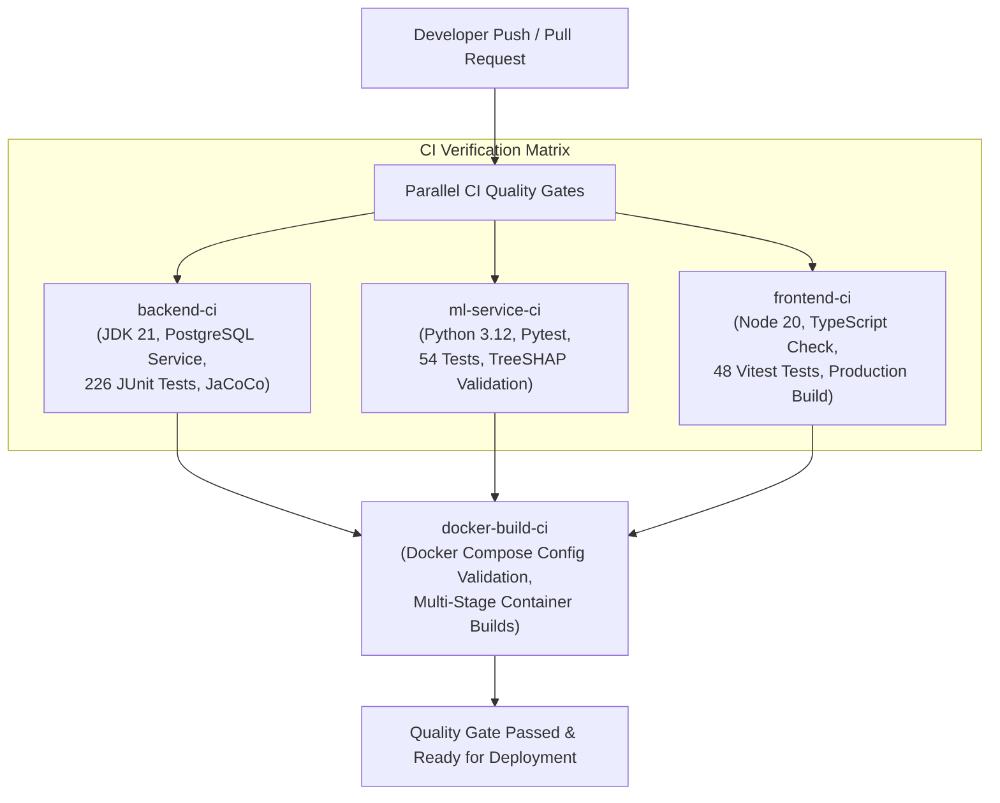

# CarePath — Enterprise Deployment, Operations & CI/CD Guide

**Document Version:** 1.0.0  
**Target Milestone:** Phase 12 Production Deployment  
**Lead Architectural Focus:** CI/CD Automation, Container Security, Zero-Downtime Migration & Disaster Recovery

---

## 1. Deployment Architecture

CarePath is deployed using an isolated multi-container architecture. Public traffic terminates at an edge NGINX reverse proxy, while the database, backend application server, and machine learning microservice communicate strictly over an internal Docker network.

```
+---------------------------------------------------------------------------------------------------+
|                                          PUBLIC INTERNET                                          |
+-------------------------------------------------+-------------------------------------------------+
                                                  |
                                             TLS (Port 443) / HTTP (Port 80)
                                                  |
+-------------------------------------------------v-------------------------------------------------+
|   EDGE WEB SERVICE (carepath-frontend-prod)                                                       |
|   - Image: nginx:1.27-alpine                                                                      |
|   - Serves React 18 SPA statically                                                                |
|   - Gzip compression & OWASP security headers (CSP, HSTS, X-Frame-Options, X-Content-Type-Options)   |
|   - Reverse proxy routes /api/ -> carepath-backend:8080                                           |
|   - Reverse proxy routes /ml/  -> carepath-ml-service:8000                                        |
+-------------------------------------------------+-------------------------------------------------+
                                                  |
                                  Internal Docker Bridge Network
                                                  |
         +----------------------------------------+----------------------------------------+
         |                                                                                 |
+--------v----------------------------------------+       +--------------------------------v--------+
|   CORE APPLICATION BACKEND (carepath-backend)   |       |   ML MICROSERVICE (carepath-ml-service) |
|   - Image: eclipse-temurin:21-jre-alpine        |       |   - Image: python:3.12-slim             |
|   - Spring Boot 3.4.3                           |       |   - FastAPI / Uvicorn                   |
|   - Non-root user: carepath:carepath            |       |   - TreeSHAP & Constrained CF Engine    |
|   - In-process Async Thread Pools               |       |   - Model: carepath-gbm-v1.0.0          |
|   - Health & Readiness Probes                   |       |   - Health & Readiness Probes           |
+------------------------+------------------------+       +-----------------------------------------+
                         |
                 PostgreSQL Wire Protocol
                         |
+------------------------v------------------------+
|   RELATIONAL DATABASE (carepath-postgres)       |
|   - Image: postgres:17-alpine                   |
|   - Automated Flyway Schema Migrations (V1-V3)  |
|   - Persistent Named Volume Storage             |
|   - NOT exposed to the public internet          |
+-------------------------------------------------+
```

---

## 2. Production Environment Variables

All production environment variables must be injected securely via platform secret vaults (e.g. AWS Secrets Manager, GitHub Encrypted Secrets, Kubernetes Secrets, or Docker Compose `.env` files with `chmod 600`).

| Variable Name | Required | Default / Example | Purpose & Security Sensitivity |
| :--- | :---: | :--- | :--- |
| `SPRING_PROFILES_ACTIVE` | Yes | `prod` | Activates production-hardened Spring profiles. |
| `DB_NAME` | Yes | `carepath` | Target PostgreSQL database name. |
| `DB_USERNAME` | Yes | `postgres` | Database administrator or application user. |
| `DB_PASSWORD` | **CRITICAL** | *Secret* | Strong database password (minimum 16 chars). |
| `SPRING_DATASOURCE_URL` | Optional | `jdbc:postgresql://postgres:5432/${DB_NAME}` | Full JDBC connection string (for external RDS / Supabase). |
| `DB_POOL_MAX_SIZE` | No | `15` | HikariCP maximum connection pool size. |
| `DB_POOL_MIN_IDLE` | No | `5` | HikariCP minimum idle connections. |
| `JWT_SECRET` | **CRITICAL** | *256-bit Hex* | Secret key for signing HMAC-SHA256 tokens (`openssl rand -hex 32`). |
| `JWT_ACCESS_TOKEN_EXPIRATION_MS` | No | `900000` | Access token lifespan (15 minutes). |
| `JWT_REFRESH_TOKEN_EXPIRATION_MS` | No | `604800000` | Refresh token lifespan (7 days). |
| `APP_CORS_ALLOWED_ORIGINS` | Yes | `https://app.carepath.io` | Comma-delimited list of allowed browser origins. |
| `RATE_LIMITING_ENABLED` | No | `true` | Enables sliding-window IP rate limiting. |
| `RATE_LIMIT_AUTH_PER_MIN` | No | `15` | Max authentication attempts per IP per minute. |
| `RATE_LIMIT_ML_PER_MIN` | No | `45` | Max ML inference calls per IP per minute. |
| `RATE_LIMIT_DEFAULT_PER_MIN` | No | `100` | Max general API calls per IP per minute. |
| `EMAIL_PROVIDER` | No | `console` | Notification email delivery provider (`console`, `smtp`). |
| `EMAIL_FROM` | No | `noreply@carepath.io` | Outbound email sender address. |
| `NOTIFICATIONS_REMINDERS_ENABLED`| No | `true` | Enables background scheduled patient reminder jobs. |
| `VITE_BACKEND_URL` | No | `/api/v1` | Reverse proxy relative path for backend API. |
| `VITE_ML_URL` | No | `""` | Reverse proxy relative path for ML microservice. |

---

## 3. Database Migration Management

CarePath uses **Flyway** for database migrations:
- **Migration Location:** `backend/src/main/resources/db/migration/`
- **Schema History:** `flyway_schema_history` table tracks applied migrations with checksums.
- **Startup Execution:** Migrations run automatically when the Spring Boot application container initializes.

### Migration Sequence:
1. `V1__initial_schema.sql`: Core users, patient profiles, clinician profiles, delegation grants, vitals, baseline tables, risk assessments, and audit logs.
2. `V2__notifications.sql`: Notification ledger, user delivery channels, and preference matrix.
3. `V3__security_audit_hardening.sql`: Nullable actor for unauthenticated security events, enhanced audit metadata columns, and performance indexing.

### Migration Safety Rules:
- **Never modify an existing migration script** after deployment. Always create a new versioned script (`V4__...`).
- **All production migrations must be backward-compatible** (`ADD COLUMN IF NOT EXISTS`, default values, non-locking index creation).
- **No destructive drops in production**: Columns and tables must undergo a two-phase deprecation cycle before removal.

---

## 4. Machine Learning Model Artifact Delivery

The ML model is version-controlled and deterministically delivered:
- **Model Version:** `carepath-gbm-v1.0.0`
- **Artifact Location:** `ml_service/app/artifacts/`
  - `model.joblib`: HistGradientBoostingClassifier calibrated with sigmoid probability mapping.
  - `preprocessor.joblib`: StandardScaler and categorical encoder pipeline.
  - `model_metadata.json`: Feature schema definitions, training metrics, class distribution, and version tags.
- **Zero Retraining Rule:** The production container build verifies artifact existence and schema compatibility at build time using `model_registry.py`. **Model retraining does not occur during deployment.**
- **Rollback Process:** Reverting the ML container image automatically restores the previous calibrated model weights without modifying the database schema.

---

## 5. Automated CI/CD Pipeline

CarePath uses **GitHub Actions** (`.github/workflows/ci.yml`) to enforce automated quality gates on every commit and pull request to `main`:



---

## 6. Health Checks & Synthetic Smoke Testing

### 6.1 Uptime Monitoring Endpoints

| Probe | Endpoint | Expected Response | Failure Meaning |
| :--- | :--- | :--- | :--- |
| **Backend Liveness** | `GET http://localhost:8080/health/liveness` | `200 UP` | JVM deadlocked or process down. |
| **Backend Readiness** | `GET http://localhost:8080/health/ready` | `200 UP` | Database connectivity failure or Hikari pool exhausted. |
| **ML Liveness** | `GET http://localhost:8000/ml/v1/health` | `200 HEALTHY` | FastAPI process unresponsive. |
| **ML Readiness** | `GET http://localhost:8000/ml/v1/health/ready` | `200 OK` (`model_loaded: true`) | Model joblib failed to load in memory. |
| **Edge Web Proxy** | `GET http://localhost:80/` | `200 OK` | NGINX container failure. |

### 6.2 Executing Automated Smoke Tests
Run the standalone verification suite:
```bash
python scripts/smoke_test.py --base-url http://localhost:80 --backend-url http://localhost:8080 --ml-url http://localhost:8000
```
This smoke test deterministically validates:
1. All 4 health and readiness probes.
2. Unauthenticated access denial (HTTP 401/403).
3. JWT registration and login lifecycle.
4. Calibrated risk predictions.
5. TreeSHAP feature attributions and counterfactual optimization plans.

---

## 7. Rollback & Disaster Recovery Procedures

### 7.1 Container Application Rollback
If a newly deployed container exhibits unexpected errors:
```bash
# Revert to previous image tag or commit
git checkout <PREVIOUS_STABLE_COMMIT>
docker compose -f docker-compose.prod.yml --env-file .env up -d --build
```

### 7.2 Database Rollback Strategy
Flyway migrations are strictly non-destructive. If a deployment must be rolled back:
1. The previous application code can safely run against the upgraded database because new columns in `V1-V3` are non-breaking (`ADD COLUMN IF NOT EXISTS`).
2. If schema rollback is strictly necessary, restore from the pre-deployment PostgreSQL snapshot:
   ```bash
   pg_restore -U postgres -d carepath pre_deployment_backup.dump
   ```

---

## 8. Operational Troubleshooting Guide

| Issue | Likely Root Cause | Remediation Step |
| :--- | :--- | :--- |
| **Backend fails on startup with `FlywayException`** | Checksum mismatch or uncommitted migration modification. | Verify that migration files have not been modified in place. Check `flyway_schema_history` table. |
| **Backend returns HTTP 503 on `/health/ready`** | PostgreSQL container unhealthy or database credentials incorrect. | Inspect `docker logs carepath-postgres-prod`. Verify `DB_PASSWORD` matches `.env`. |
| **Frontend displays "Model service is initializing"** | ML microservice not ready or failed artifact loading. | Inspect `docker logs carepath-ml-service-prod`. Verify `model.joblib` presence. |
| **Client requests return HTTP 429** | Sliding-window rate limiter triggered. | Client exceeded auth (15/min) or ML (45/min) quota. Check `Retry-After: 60` response header. |
| **HikariCP connection leak warning logged** | Database transaction open for $>5,000$ ms. | Check application logs for stack trace pointing to unclosed connection or slow query. |
