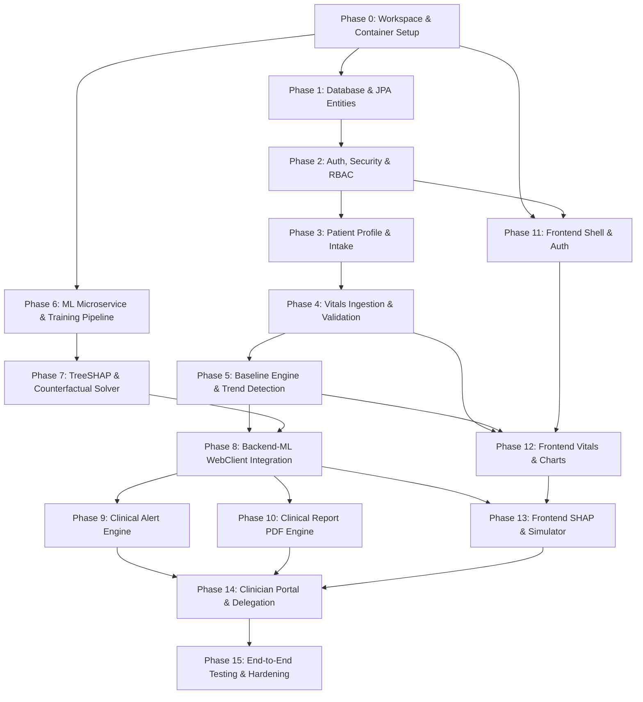

# CarePath - Dependency-Aware Development Roadmap

**Document Version:** 1.0.0  
**Project Lead:** Senior Software Architect  
**Architecture Paradigm:** Multi-Tier Clean Modular Architecture  
**Execution Strategy:** Small, Incremental, Verifiable Implementation Phases

---

## 1. Architectural Dependency Graph

The phases are structured in strict dependency order so that no module is implemented without its underlying infrastructure, contracts, or upstream data models already verified.

---

## 2. Phase-by-Phase Implementation Plan

---

### Phase 0: Workspace, Repository Structure & Docker Infrastructure
* **Objective:** Establish the multi-tier project directory structure, containerized local environment, and developer toolchains.
* **Dependencies:** None.
* **Deliverables:**
  * Root `docker-compose.yml` configuring PostgreSQL 15, Spring Boot backend, FastAPI ML service, and React frontend.
  * Maven / Gradle build configuration for Spring Boot 3.x (Java 21).
  * Python virtual environment, `pyproject.toml` or `requirements.txt` for FastAPI ML service.
  * Vite + React 18 + TypeScript + Tailwind CSS workspace initialization.
  * `.editorconfig`, `.gitignore`, and shared environment templates (`.env.example`).
* **Verification & Testing:**
  * `docker compose up -d postgres` runs cleanly and responds to `pg_isready`.
  * Spring Boot skeleton boots with `./mvnw spring-boot:run`.
  * FastAPI skeleton responds with 200 OK on `GET /ml/v1/health`.
  * React frontend serves welcome page on `http://localhost:5173`.

---

### Phase 1: Database Schema, Migrations & JPA Core Entities
* **Objective:** Define and migrate all relational database tables, foreign keys, indexes, and audit columns.
* **Dependencies:** Phase 0.
* **Deliverables:**
  * Versioned migration scripts (Flyway/Liquibase SQL) covering:
    * `users`, `patient_profiles`, `clinician_profiles`, `patient_clinician_access`
    * `vital_metrics`, `symptom_logs`, `patient_baselines`
    * `risk_assessments`, `shap_explanations`, `counterfactual_recommendations`
    * `clinical_alerts`, `audit_logs`
  * Spring Data JPA entity classes with Hibernate validation annotations (`@NotNull`, `@Size`, `@Pattern`).
  * Spring Data JPA Repository interfaces extending `JpaRepository` and `JpaSpecificationExecutor`.
* **Verification & Testing:**
  * Testcontainers integration test spinning up isolated PostgreSQL.
  * Automated migration test asserting all tables, indexes, and foreign keys create without warnings.
  * Basic CRUD tests for `User` and `PatientProfile` repositories using JUnit 5 + Spring Boot Test.

---

### Phase 2: Authentication, Authorization & Security Architecture
* **Objective:** Secure the backend with stateless JWT authentication, password hashing, and role-based access control (RBAC).
* **Dependencies:** Phase 1.
* **Deliverables:**
  * `SecurityConfig` configuring CORS, CSRF disablement (stateless), and URL access rules.
  * `JwtTokenProvider` generating signed access tokens (15m) and refresh tokens (7d).
  * `JwtAuthenticationFilter` verifying tokens on incoming requests.
  * `AuthService` handling user registration, password verification (BCrypt), login, and token refresh.
  * REST Controller: `/api/v1/auth/register`, `/api/v1/auth/login`, `/api/v1/auth/refresh`.
  * Spring Security `@PreAuthorize` method-level authorization infrastructure.
* **Verification & Testing:**
  * Unit tests with Mockito for `AuthService`.
  * MockMvc integration tests verifying:
    * Registration of duplicate email fails with 409 Conflict.
    * Weak passwords rejected with 400 Bad Request.
    * Valid login returns JWT; protected endpoint without JWT returns 401 Unauthorized.
    * Role-based access enforcement (Patient cannot access Admin endpoints).

---

### Phase 3: Patient Profile & Demographic Baseline Intake API
* **Objective:** Enable patients to create and update their demographic baseline and health history.
* **Dependencies:** Phase 2.
* **Deliverables:**
  * `PatientProfileService` and DTOs (`PatientProfileRequestDTO`, `PatientProfileResponseDTO`).
  * REST Controller: `/api/v1/patients/me`, `/api/v1/patients/{id}`.
  * Automatic BMI calculation logic upon height and weight ingestion.
  * Audit logging interceptor recording profile mutations.
* **Verification & Testing:**
  * Unit tests validating physiological bounds (height, weight ranges).
  * MockMvc tests ensuring patients can only view and update their own profile.

---

### Phase 4: Vital Metrics Ingestion & Physiological Validation Engine
* **Objective:** Support single and batch ingestion of biometric measurements with strict input validation.
* **Dependencies:** Phase 3.
* **Deliverables:**
  * `VitalMetricService` handling ingestion, batch processing, and context tagging (`FASTING`, `RESTING`, etc.).
  * Range validator rejecting non-physiological inputs (e.g., Systolic BP $> 300$ or $< 40$).
  * REST Controller: `POST /api/v1/patients/{id}/vitals`, `POST /api/v1/patients/{id}/vitals/batch`, `GET /api/v1/patients/{id}/vitals` with pagination and date-range filters.
  * Spring ApplicationEvent publication (`VitalMetricLoggedEvent`) for downstream asynchronous processors.
* **Verification & Testing:**
  * Unit tests verifying range boundary rejections.
  * Repository performance tests executing time-series range queries with composite indexes.
  * Integration tests verifying batch ingestion within a single ACID transaction.

---

### Phase 5: Personal Baseline Calculation & Trajectory Trend Detection
* **Objective:** Build the core statistical engine to establish personal baselines and detect longitudinal trends.
* **Dependencies:** Phase 4.
* **Deliverables:**
  * `BaselineEngineService`:
    * Sliding 30-day window aggregator.
    * EWMA algorithm ($\alpha = 0.2$).
    * Median, IQR ($Q_{25}, Q_{75}$), and standard deviation calculation.
  * `TrendDetectionService`:
    * Ordinary Least Squares (OLS) linear regression computing 7d, 14d, and 30d trajectory slopes ($\beta$).
    * Student's t-test significance testing ($p$-value).
    * Anomaly classifier separating transient spikes from sustained drift.
  * REST Controller: `GET /api/v1/patients/{id}/baselines`.
* **Verification & Testing:**
  * Unit tests on mathematical functions using known statistical synthetic datasets.
  * Verification that single-day outliers do not drastically distort the EWMA and IQR baseline corridors.
  * Trajectory slope tests asserting correct positive, flat, and negative trend classifications.

---

### Phase 6: Machine Learning Microservice & Calibrated Risk Model
* **Objective:** Create the standalone FastAPI microservice, feature engineering pipeline, and calibrated ensemble risk model.
* **Dependencies:** Phase 0.
* **Deliverables:**
  * Python FastAPI application skeleton with Pydantic v2 schemas.
  * Synthetic clinical cohort dataset generation script (incorporating CDC NHANES & Framingham statistical distributions).
  * Training pipeline using `HistGradientBoostingClassifier` calibrated with `CalibratedClassifierCV(method='sigmoid')`.
  * Model serialization pipeline (saving model, feature scalers, and reference background summary via `joblib`).
  * REST Endpoint: `POST /ml/v1/risk/predict`, `GET /ml/v1/health`.
* **Verification & Testing:**
  * Pytest suite verifying model load, input schema validation, and probability output calibration ($0.00 \le R \le 1.00$).
  * Calibration verification asserting Brier score $< 0.12$.
  * End-to-end response latency benchmark asserting $< 100$ ms for raw inference.

---

### Phase 7: TreeSHAP Explainability & Counterfactual Optimization Solver
* **Objective:** Implement local feature attribution via TreeSHAP and the constrained "What-If" counterfactual solver.
* **Dependencies:** Phase 6.
* **Deliverables:**
  * `shap_explainer.py` utilizing `shap.TreeExplainer` over background dataset summary.
  * Local additivity validation: $\phi_0 + \sum \phi_i = f(\mathbf{x})$.
  * Natural Language Generation (NLG) mapper generating patient-friendly descriptions from top SHAP features.
  * `counterfactual_engine.py` implementing constrained greedy sensitivity optimization over modifiable biometric parameters.
  * REST Endpoints: `POST /ml/v1/risk/explain`, `POST /ml/v1/risk/counterfactual`.
* **Verification & Testing:**
  * Pytest test asserting local additivity holds within $10^{-4}$ tolerance.
  * Invariance tests verifying immutable features (age, sex) are never modified by the counterfactual solver.
  * Plausibility clamp tests ensuring simulated vitals do not produce unphysiological values.

---

### Phase 8: Spring Boot to ML WebClient Integration & Resilient Risk Evaluation
* **Objective:** Connect the Spring Boot backend to the FastAPI ML service with circuit breakers, timeouts, and persistence.
* **Dependencies:** Phase 5, Phase 7.
* **Deliverables:**
  * `MlServiceClient` using Spring WebClient / RestClient with connection pooling and timeouts (max 1.5s).
  * Fallback strategy: If ML service times out or errors, return rule-based baseline status with graceful warning badge without throwing 500 error.
  * `RiskEvaluationService` assembling demographic and longitudinal features, invoking FastAPI, and persisting `RiskAssessment` and `ShapExplanation` entities.
  * REST Endpoints: `GET /api/v1/patients/{id}/risks/latest`, `POST /api/v1/patients/{id}/risks/evaluate`, `POST /api/v1/patients/{id}/risks/counterfactual`.
* **Verification & Testing:**
  * MockWebServer integration tests simulating FastAPI success, timeout, and HTTP 500 scenarios.
  * Verification that risk evaluations and SHAP snapshots are accurately persisted in PostgreSQL.

---

### Phase 9: Notifications & Asynchronous Services [COMPLETED]
* **Objective:** Implement a reliable, decoupled notification architecture supporting in-app alerts, user notification preferences, development-safe email dispatch, scheduled reminders, and background asynchronous processing.
* **Dependencies:** Phase 2, Phase 8.
* **Deliverables:**
  * Database Migration: `V2__notifications.sql` creating `notifications` and `notification_preferences` tables with PostgreSQL indexes and constraints.
  * Domain Models: `Notification` and `NotificationPreference` JPA entities mapped to `User`.
  * Notification Providers: Extensible `NotificationProvider` abstraction with `InAppNotificationProvider` and `EmailNotificationProvider` (supporting console, mock, and SMTP modes).
  * Asynchronous Execution: `AsyncConfig` with `@EnableAsync`, `@EnableScheduling`, and dedicated `notificationTaskExecutor` thread pool.
  * Event-Driven Pipeline: Spring domain events (`RiskAssessmentCompletedEvent`, `ReminderEvent`) processed asynchronously via `NotificationEventListener`.
  * Core Services:
    * `NotificationService`: Lifecycle management, user preference filtering, idempotency guard via `eventId`, and ownership enforcement.
    * `NotificationPreferenceService`: Default initializations, channel toggles, and updates.
    * `ReminderService`: Idempotent vitals reminders and daily background scheduler.
    * `RiskAssessmentService`: Assessment persistence and automated completion notification dispatch.
  * REST Endpoints:
    * `/api/v1/notifications`: Paginated retrieval with unread filters.
    * `/api/v1/notifications/unread-count`: Fast header badge count.
    * `/api/v1/notifications/{id}/read`: Mark individual notification as read.
    * `/api/v1/notifications/read-all`: Mark all notifications as read.
    * `/api/v1/notification-preferences`: Query and update user channel/trigger preferences.
    * `/api/v1/risk-assessments`: Submit risk assessment evaluation and query latest result.
  * Frontend Integration:
    * `NotificationDropdown`: Bell trigger, animated badge, real-time polling, relative timestamps, tabs, and mark as read.
    * `NotificationPreferencesModal`: In-App, Email, Assessment Completed, Vitals Reminders, and System Updates toggles.
    * Header integration in `Navbar` and wiring in `App.tsx`.
* **Verification & Testing:**
  * Backend: 30 unit tests covering services, providers, listeners, and controllers (`mvnw test`).
  * Frontend: 43 unit and integration tests covering components, dropdowns, modals, and services (`npm test`).
  * Full regression: 103 backend tests + 43 frontend tests passing with 0 failures.

---

### Phase 10: Security Hardening, Role-Based Access Control (RBAC), Audit Logging & API Security [COMPLETED]
* **Objective:** Implement comprehensive application security hardening, multi-role RBAC enforcement, relationship-based clinician access control, immutable audit logging with credential scrubbing, sliding-window rate limiting, and an administrative security monitoring console.
* **Dependencies:** Phase 2, Phase 8, Phase 9.
* **Deliverables:**
  * Database Migration: `V3__security_audit_hardening.sql` updating `audit_logs` schema with `actor_email`, `user_agent`, `status`, and performance indexes.
  * Access Control Layer: `AccessControlService` enforcing patient ownership, active clinician-patient assignments (`PatientClinicianAccess`), and global administrative authorization.
  * Audit Logging System: `AuditLogService` with automatic credential/secret sanitization, dynamic query specification executor, and immutability guarantees.
  * Privilege Escalation Guard: Enforced `ROLE_PATIENT` on public self-registration (`AuthService.register()`) and admin-only role promotions.
  * Rate Limiting & Protection: In-memory sliding-window `RateLimitingFilter` enforcing 10 req/min on `/api/v1/auth/**`, 30 req/min on ML endpoints, and 100 req/min on general APIs with standard HTTP 429 and `Retry-After: 60`.
  * Security Headers & CORS: Hardened CSP, HSTS, X-Content-Type-Options, X-Frame-Options, Referrer-Policy, and configurable CORS allowlist (`app.cors.allowed-origins`).
  * Administrative API: `AdminController` at `/api/v1/admin/**` protected with `@PreAuthorize("hasRole('ADMIN')")` for audit logs, security telemetry, and user management.
  * Frontend Security Console: `AdminAuditLogPage`, `adminService`, and role-based navigation tabs in `Navbar` and `App.tsx`.
  * Security Architecture Documentation: `docs/SECURITY.md`.
* **Verification & Testing:**
  * Backend: 216 unit and integration tests passing (`mvnw test`).
  * Frontend: 45 unit and integration tests passing across 10 test suites (`npm test`).
  * Full production build passing (`npm run build`).

---

### Phase 11: Testing, Observability & Production Readiness [COMPLETED]
* **Objective:** Establish end-to-end observability, deep health monitoring, resilient asynchronous execution, automated quality gates, and multi-stage container orchestration across all platform layers.
* **Dependencies:** Phases 0 through 10.
* **Deliverables:**
  * Request Correlation ID & Tracing: `CorrelationIdFilter` on Spring Boot and `correlation_id_middleware` on FastAPI enforcing `X-Request-ID` propagation, SLF4J MDC injection, and structured log format `[%X{requestId}]`.
  * Deep Health & Readiness Probes: Spring Boot Actuator and `HealthCheckController` exposing `/health`, `/health/liveness`, and `/health/ready` (validating database connectivity), plus FastAPI `/health/ready` (validating model artifact load state).
  * Resiliency & Threading Guardrails: Bounded notification thread pool with `ThreadPoolExecutor.CallerRunsPolicy` backpressure and HikariCP connection pool leak detection threshold at 5,000 ms.
  * Multi-Stage Production Containerization: Multi-stage Dockerfiles for backend (`eclipse-temurin:21-jre-alpine` non-root) and frontend (`nginx:1.27-alpine` reverse proxy & SPA routing), plus unified `docker-compose.yml` with health-driven dependency graph.
  * Quality Gates & Test Suites:
    * Backend: 226 unit & integration tests passing (`BUILD SUCCESS`) with JaCoCo plugin configured.
    * ML Microservice: 54 pytest tests passing covering model loading, inference, TreeSHAP explainer, counterfactual solver, and boundary safeguards.
    * Frontend: 48 Vitest tests passing across 11 test suites including end-to-end user workflows (`E2EWorkflowScenarios.test.tsx`), and clean production bundle compilation (`npm run build`).
  * Comprehensive Production Readiness Documentation: `docs/PRODUCTION_READINESS.md`.
* **Verification & Testing:**
  * Backend: 226/226 tests passing (`mvnw test`).
  * ML Microservice: 54/54 tests passing (`pytest tests/`).
  * Frontend: 48/48 tests passing (`npx vitest run`).
  * Production bundle: `npm run build` succeeds in 5.46s with zero errors.
  * Docker compose: `docker compose config` validates 4 interconnected services with health dependencies.

---

### Phase 12: Deployment, CI/CD & Production Configuration [COMPLETED]
* **Objective:** Establish reproducible container deployment, production environment segmentation, automated multi-stage GitHub Actions CI/CD pipeline, and non-destructive database migration controls.
* **Dependencies:** Phases 0 through 11.
* **Deliverables:**
  * Production Docker Configuration: Hardened multi-stage Dockerfiles for backend (JRE 21 Alpine non-root user), ML microservice (Python 3.12 without build-time retraining), and frontend (NGINX 1.27 Alpine with SPA reverse proxy and gzip compression).
  * Production Docker Compose Stack: `docker-compose.prod.yml` with private bridge network (`carepath-internal-network`), persistent named volumes, strict healthcheck dependency ordering, and zero public port exposures on PostgreSQL (5432) or Spring Boot (8080).
  * Environment & Secret Separation: Comprehensive `.env.example` and `frontend/.env.example` templates with documentation of required production variables, token lifespans, and rate limits.
  * Spring Boot Production Profile: `backend/src/main/resources/application-prod.yml` configuring production HikariCP connection pool settings, Flyway validation, and restricted logging levels.
  * Automated Multi-Stage GitHub Actions CI/CD Pipeline: `.github/workflows/ci.yml` orchestrating parallel jobs for `backend-ci` (PostgreSQL service container, 226 tests, JaCoCo), `ml-service-ci` (Python 3.12, 54 pytest tests, TreeSHAP validation), `frontend-ci` (Node 20, TypeScript typecheck, 48 Vitest tests, production build), and `docker-build-ci` (compose config check and image builds).
  * Deterministic Pre-trained Model Artifact Delivery: Sealed version `carepath-gbm-v1.0.0` with 18-feature schema metadata, verified via `model_registry.py` during build time without retraining.
  * Automated Production Smoke Test Suite: `scripts/smoke_test.py` deterministically testing health probes, authentication rejection, login tokens, risk predictions, TreeSHAP attributions, and counterfactuals.
  * Comprehensive Deployment Documentation: Root `README.md` and detailed operations guide in `docs/DEPLOYMENT.md`.
* **Verification & Testing:**
  * Production Docker Compose: `docker compose -f docker-compose.prod.yml config` passes with zero errors.
  * CI Pipeline: Fully defined and syntax-validated in `.github/workflows/ci.yml`.
  * Frontend Production Build: `npm run build` succeeds in 5.46s with zero errors.
  * Backend Quality Gate: 226 unit and integration tests passing (`mvnw test`).
  * ML Microservice Gate: 54 pytest tests passing (`pytest tests/`).
  * Frontend Quality Gate: 48 Vitest tests passing across 11 test suites (`vitest run`).
  * Model Registry Gate: Pre-packaged artifacts verified deterministically without retraining.

---

### Phase 13: Frontend Explainable Risk Dashboard, SHAP Waterfall & What-If Simulator
* **Objective:** Create the explainability dashboard, SHAP waterfall visualizer, and interactive counterfactual simulation controls.
* **Dependencies:** Phase 8, Phase 12.
* **Deliverables:**
  * `RiskGaugeCard` displaying calibrated risk score ($0.00 - 1.00$) and color-coded tier badge (`LOW`, `MODERATE`, `ELEVATED`, `HIGH`).
  * `ShapWaterfallChart` (Recharts horizontal bar / waterfall) visualizing positive risk drivers and negative protective factors.
  * Natural language summary card translating mathematical attributions into plain English.
  * `WhatIfSimulator` widget:
    * Interactive sliders for modifiable features (Systolic BP, Fasting Glucose, Sleep Hours).
    * Real-time debounced calls to `/risks/counterfactual`.
    * Visual delta display showing projected risk reduction and tier transitions.
  * Permanent regulatory non-diagnostic disclaimer banner.
* **Verification & Testing:**
  * User interaction testing with counterfactual sliders verifying debounced updates and smooth UI transitions.
  * Accessibility audit (contrast ratios and ARIA live regions).

---

### Phase 14: Clinician Portal, Access Delegation Flow & Doctor Report View
* **Objective:** Implement doctor dashboard, patient roster, time-limited delegation code exchange, and clinical report downloads.
* **Dependencies:** Phase 9, Phase 10, Phase 13.
* **Deliverables:**
  * Patient delegation UI: Patient generates 6-character ephemeral access code (`CARE-XXXX-XXX`).
  * Clinician Portal: Doctor enters grant code to attach patient to their clinical roster.
  * Clinician Patient Detail View: High-density clinical overview with longitudinal trends, SHAP attribution, and alert acknowledgment controls.
  * One-click "Download Doctor-Ready PDF Report" button with progress indicator.
* **Verification & Testing:**
  * Delegation flow testing: Clinician cannot access patient record without valid, active delegation grant.
  * Revocation test: Patient revokes access; clinician immediately loses access.
  * PDF report download verification in browser.

---

### Phase 15: End-to-End Integration, Security Hardening & Synthetic Scenario Walkthrough
* **Objective:** Full platform integration testing, security audit, synthetic patient scenario population, and documentation completion.
* **Dependencies:** All previous phases.
* **Deliverables:**
  * Synthetic demo data seeder script populating 3 distinct patient personas:
    * *Persona 1:* Healthy individual with stable longitudinal baseline.
    * *Persona 2:* Pre-diabetic individual with sustained 14-day upward glucose and BP drift.
    * *Persona 3:* Individual experiencing an acute physiological anomaly and safety alert.
  * OWASP Top 10 security audit (SQL injection, XSS, CSRF, security headers, JWT tamper resistance).
  * Automated end-to-end integration test suite verifying complete flow from vitals entry to SHAP explainability and PDF generation.
  * Final documentation verification: `README.md`, deployment guide, and developer onboarding instructions.
* **Verification & Testing:**
  * Full `docker compose up` starts all 4 services with zero manual interventions.
  * End-to-end synthetic demo scenario execution successfully demonstrates all functional requirements.
